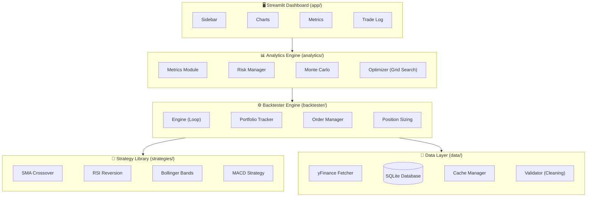

<div align="center">

# 📈 Quant Research Platform

**A production-ready quantitative research and backtesting platform built with Python.**

[](https://python.org)
[](LICENSE)
[](#testing)
[](#testing)

*Backtest trading strategies with real market data, analyze performance metrics, and visualize results through an interactive Streamlit dashboard.*

</div>

---

## 🎯 Problem Statement

Retail traders and quant enthusiasts need a way to **backtest trading strategies** before risking real capital. This platform provides a modular, end-to-end pipeline:

1. **Fetch** → Real market data via Yahoo Finance with smart caching
2. **Signal** → Generate buy/sell signals using configurable strategies
3. **Simulate** → Day-by-day backtesting with transaction costs and position sizing
4. **Analyze** → 15+ performance metrics including Sharpe, Sortino, Alpha, VaR
5. **Visualize** → Interactive dashboard with equity curves, drawdown charts, and Monte Carlo simulations

---

## 🏗️ Architecture



---

## ✨ Key Features

| Feature | Description |
|---------|-------------|
| **5 Trading Strategies** | SMA Crossover, RSI Mean Reversion, Bollinger Bands, MACD, Buy & Hold (benchmark) |
| **Look-Ahead Bias Prevention** | `signal.shift(1)` ensures trades execute on T+1, not T |
| **Smart Data Caching** | SQLite database with intelligent gap detection — only fetches missing date ranges |
| **Transaction Costs** | Configurable commission (0.1%) and slippage (0.05%) applied to every trade |
| **Position Sizing** | Fixed capital %, fixed shares, and Kelly Criterion methods |
| **15+ Performance Metrics** | CAGR, Sharpe, Sortino, Calmar, Max DD, Win Rate, Profit Factor, VaR, CVaR, Alpha, Beta |
| **Walk-Forward Analysis** | Rolling window out-of-sample testing to detect overfitting |
| **Monte Carlo Simulation** | 1000 bootstrap paths for probabilistic risk assessment |
| **Parameter Optimization** | Grid search to find optimal strategy parameters |
| **Interactive Dashboard** | Streamlit UI with Plotly charts, benchmark comparison, and trade log |
| **Comprehensive Tests** | 55 unit tests covering all modules with deterministic fixtures |

---

## 🚀 Quick Start

### Prerequisites
- Python 3.10+
- pip

### Installation

```bash
# 1. Clone the repository
git clone https://github.com/RintuRifle/alpha-engine.git
cd quant_research_platform

# 2. Create virtual environment
python -m venv venv
venv\Scripts\activate        # Windows
# source venv/bin/activate   # macOS/Linux

# 3. Install dependencies
pip install -r requirements.txt
pip install -e .

# 4. Configure environment
copy .env.example .env       # Windows
# cp .env.example .env       # macOS/Linux

# 5. Launch the dashboard
streamlit run app/streamlit_app.py
```

### Available Commands

```bash
make run        # Launch Streamlit dashboard
make test       # Run all unit tests
make coverage   # Run tests with coverage report
make lint       # Run flake8 linter
make format     # Auto-format code with black
make mypy       # Run static type checking
make ingest     # Fetch market data into SQLite
make clean      # Remove build artifacts
```

---

## 📊 Strategies Implemented

### 1. SMA Crossover
Buy when short-term SMA crosses above long-term SMA. Classic trend-following.
- **Parameters**: `short_window` (default: 50), `long_window` (default: 200)

### 2. RSI Mean Reversion
Buy when RSI drops below 30 (oversold), sell when RSI exceeds 70 (overbought).
- **Parameters**: `window` (14), `oversold` (30), `overbought` (70)

### 3. Bollinger Bands
Buy when price drops below the lower band, sell when price exceeds the upper band.
- **Parameters**: `window` (20), `num_std` (2.0)

### 4. MACD Signal Crossover
Buy when MACD line crosses above signal line, sell when it crosses below.
- **Parameters**: `fast_period` (12), `slow_period` (26), `signal_period` (9)

### 5. Buy & Hold (Benchmark)
Always buy, never sell. The baseline every strategy is compared against.

---

## 🧪 Testing

```bash
# Run all tests
pytest tests/ -v

# Run with coverage
pytest tests/ --cov=src --cov-report=term-missing -v
```

**55 tests** across 4 test files covering:
- Data validation (NaN handling, OHLCV sanity, volume checks)
- Strategy signals (all 5 strategies, synthetic data verification)
- Backtester engine (equity curve, trades, transaction costs, position sizing)
- Analytics (CAGR, Sharpe, Max DD, Win Rate with known values)

---

## 📁 Project Structure

```
quant_research_platform/
├── config/
│   └── config.yaml              # DB path, capital, commission, strategy defaults
├── src/
│   ├── data/
│   │   ├── fetcher.py           # yfinance API + rate limiting + retry
│   │   ├── database.py          # SQLAlchemy ORM, parameterized queries
│   │   ├── validator.py         # NaN handling, OHLCV sanity checks
│   │   └── cache_manager.py     # Smart caching with gap detection
│   ├── strategies/
│   │   ├── base_strategy.py     # Abstract base class
│   │   ├── ma_crossover.py      # SMA/EMA crossover
│   │   ├── rsi_reversion.py     # RSI mean reversion
│   │   ├── bollinger_bands.py   # Bollinger band breakout
│   │   ├── macd_strategy.py     # MACD signal crossover
│   │   └── buy_and_hold.py      # Benchmark strategy
│   ├── backtester/
│   │   ├── engine.py            # Day-by-day simulation (signal.shift(1)!)
│   │   ├── portfolio.py         # Cash, positions, equity curve
│   │   ├── order_manager.py     # BUY/SELL execution + cash check
│   │   ├── transaction_costs.py # Commission + slippage
│   │   └── position_sizing.py   # Fixed %, fixed shares, Kelly Criterion
│   ├── analytics/
│   │   ├── metrics.py           # Sharpe, Sortino, Calmar, CAGR, Win Rate
│   │   ├── risk_manager.py      # VaR, CVaR, Alpha, Beta
│   │   ├── benchmark.py         # SPY/NIFTY baseline comparison
│   │   ├── walk_forward.py      # Rolling window out-of-sample testing
│   │   ├── optimizer.py         # Grid search parameter optimization
│   │   ├── monte_carlo.py       # 1000-path equity simulation
│   │   └── report_generator.py  # QuantStats HTML tear sheets
│   └── utils/
│       ├── logger.py            # RotatingFileHandler + console
│       ├── helpers.py           # Config loader, formatters, utilities
│       ├── exceptions.py        # Custom exceptions with context
│       └── type_hints.py        # TypedDicts for type safety
├── app/
│   ├── streamlit_app.py         # Main dashboard entry point
│   └── components/
│       ├── sidebar.py           # Inputs, strategy params, date picker
│       ├── charts.py            # Plotly: equity, drawdown, histogram, MC
│       └── metrics_display.py   # 8 KPI cards with color coding
├── tests/
│   ├── conftest.py              # Deterministic fixtures (seeded RNG)
│   ├── test_data_ingestion.py   # 8 tests: validator + mocked fetcher
│   ├── test_strategies.py       # 15 tests: all strategies + bias check
│   ├── test_backtester.py       # 12 tests: engine, costs, sizing
│   └── test_analytics.py        # 20 tests: metrics verification
├── .env.example                 # Template for secrets
├── .gitignore                   # Excludes venv, data, logs, .env
├── Makefile                     # make run | test | coverage | lint
├── setup.py                     # Package installer
├── requirements.txt             # Pinned dependencies
└── README.md                    # You are here
```

---

## 🛡️ Security

- API keys and secrets are stored in `.env` (never committed)
- `.env.example` is committed with placeholder values
- Database queries use parameterized SQL (no SQL injection)
- All user inputs are sanitized before use

---

## 🔧 Configuration

All settings are centralized in `config/config.yaml`:

```yaml
trading:
  initial_capital: 10000.0
  commission: 0.001   # 0.1% per trade
  slippage: 0.0005    # 0.05% slippage

position_sizing:
  method: "fixed_capital"
  allocation: 0.10    # 10% per trade

data:
  default_tickers: ["AAPL", "MSFT", "RELIANCE.NS", "INFY.NS", "TCS.NS"]
  benchmark_ticker: "SPY"
```

---

## 📄 License

This project is licensed under the MIT License — see the [LICENSE](LICENSE) file.

---

<div align="center">

**Built with ❤️ by [Akshit Kumar Tiwari](https://github.com/RintuRifle)**

*If you found this useful, give it a ⭐ on GitHub!*

</div>
