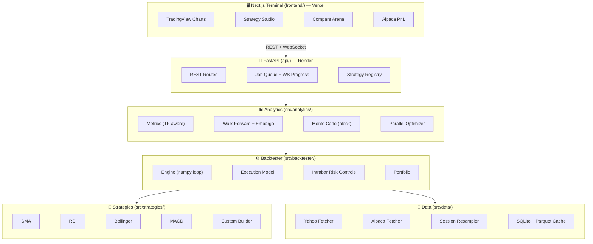

<div align="center">

# <i class="fa-solid fa-layer-group"></i> Alpha Engine

**Advanced quantitative research, backtesting, and portfolio optimization platform — Python engine, FastAPI backend, Next.js trading terminal.**

[](https://python.org)
[](#-web-terminal-v2)
[](LICENSE)
[](#-testing)
[](DEPLOYMENT.md)

*Timeframe-agnostic backtesting (1m → 1D), execution-realism modeling, walk-forward validation with strict train/test isolation, and a dark Bloomberg-style web terminal.*

</div>

---

## 🖥️ Web Terminal (v2)

The engine ships with a decoupled web stack:

- **`/api`** — FastAPI backend wrapping the `/src` quant modules. Async job
  queue with WebSocket progress streaming (REST-polling fallback), REST
  endpoints for backtests, strategy comparison, grid-search optimization,
  walk-forward analysis, OHLCV data, and read-only Alpaca account/PnL.
- **`/frontend`** — Next.js 14 + TypeScript + Tailwind terminal UI:
  TradingView candlestick charts with trade markers, equity vs benchmark,
  monthly return heatmaps, underwater drawdown curves, rolling Sharpe/Sortino,
  Monte Carlo fan charts, optimizer sensitivity surfaces, and a live Alpaca
  panel. IBM Plex Mono, amber-on-black, built to feel like a desk terminal.

**Deploy:** backend → Render (`Dockerfile.api`), frontend → Vercel
(root dir `frontend`). Full guide in **[DEPLOYMENT.md](DEPLOYMENT.md)**.
The original Streamlit app (`/app`) still works and is untouched.

---

## 🎯 Highlights

- **Timeframe-Agnostic Engine (1m → 1D):** one event loop for daily and intraday bars — signals execute on the *next bar's open*, risk resets are per session, metrics annualize by inferred bar frequency (√252 is not blindly applied to minute data), and intraday-only strategies can force square-off at each session close.
- **Execution Realism:** configurable bid-ask spread, three slippage models (fixed bps, volatility-scaled, square-root volume impact), max-participation liquidity caps with partial fills, and Reg-T style short margin. Every result carries an explicit `assumptions` block — backtests are honest about what they simulate.
- **Correct Intrabar Risk:** ATR stops trigger on the bar's high/low (not just the open), gap-through-stops fill at the open, and trailing stops update only *after* the same bar's stop check — no same-bar look-ahead.
- **Validation That Fights Overfitting:** walk-forward with strict per-window train→optimize→freeze→test isolation and embargo gaps, in-sample vs out-of-sample Sharpe degradation reporting, block-bootstrap Monte Carlo (preserves volatility clustering), parameter-plateau stability verdicts, and composite robustness ranking that discounts low trade counts.
- **Multi-Year Intraday Data:** Yahoo Finance for daily bars; **Alpaca Market Data** for years of minute bars on US equities (auto-routing when the requested range exceeds Yahoo's limits), with session-aware resampling (bars anchor to 09:15/09:30 session opens, never midnight) and Parquet caching.
- **Scale:** the simulation loop runs on pre-extracted numpy arrays — **50,000 minute-bars with ATR stops simulate in ≈0.4s**; parallel grid search via joblib.
- **Regime-Aware Signal Gating:** automated ADX/volatility regime detector that filters signals to compatible market conditions.

---

## 🏗️ Architecture


```mermaid
flowchart TD
    subgraph FE ["🖥️ Next.js Terminal (frontend/) — Vercel"]
        direction LR
        Charts["TradingView Charts"] ~~~ Studio["Strategy Studio"] ~~~ Arena["Compare Arena"] ~~~ Live["Alpaca PnL"]
    end

    subgraph API ["🔌 FastAPI (api/) — Render"]
        direction LR
        Routes["REST Routes"] ~~~ Jobs["Job Queue + WS Progress"] ~~~ Registry["Strategy Registry"]
    end

    subgraph Analytics ["📊 Analytics (src/analytics/)"]
        direction LR
        MetricsMod["Metrics (TF-aware)"] ~~~ WF["Walk-Forward + Embargo"] ~~~ MC["Monte Carlo (block)"] ~~~ Opt["Parallel Optimizer"]
    end

    subgraph Backtest ["⚙️ Backtester (src/backtester/)"]
        direction LR
        Engine["Engine (numpy loop)"] ~~~ Exec["Execution Model"] ~~~ Risk["Intrabar Risk Controls"] ~~~ Portfolio["Portfolio"]
    end

    subgraph Strategies ["🧠 Strategies (src/strategies/)"]
        direction LR
        SMA["SMA"] ~~~ RSI["RSI"] ~~~ BB["Bollinger"] ~~~ MACD["MACD"] ~~~ Custom["Custom Builder"]
    end

    subgraph Data ["💾 Data (src/data/)"]
        direction LR
        YF["Yahoo Fetcher"] ~~~ ALP["Alpaca Fetcher"] ~~~ RS["Session Resampler"] ~~~ Cache["SQLite + Parquet Cache"]
    end

    FE -->|REST + WebSocket| API
    API --> Analytics
    Analytics --> Backtest
    Backtest --> Strategies
    Backtest --> Data
```

---

## ✨ Key Features

| Feature | Description |
|---------|-------------|
| **Timeframes** | `1m / 5m / 15m / 30m / 1h / 1d` on every endpoint; session-aware resampling; intraday square-off; per-session circuit breaker |
| **9 Trading Strategies** | SMA Crossover, RSI Reversion, Bollinger Bands, MACD, Multi-Factor, Momentum+MR, VWAP Reversion, Buy & Hold, Custom Builder |
| **Custom Strategy Builder** | Indicators + pandas-expression buy/sell rules, from the UI |
| **Look-Ahead Bias Prevention** | `signal.shift(1)` (bar T signal → bar T+1 open fill) + trailing-stop ordering that can't peek at the same bar |
| **Intrabar Stop Losses** | ATR stops on high/low with gap-through-at-open fills; conservative same-bar policy |
| **Execution Model** | Bid-ask spread, fixed / volatility / volume-impact slippage, participation caps → partial fills, short margin (`short_margin_pct`) |
| **Data Sources** | Yahoo (daily, short intraday) + **Alpaca** (years of US minute bars, adjusted, session-filtered) with `auto` routing |
| **15+ Metrics (TF-aware)** | CAGR, Sharpe, Sortino, Calmar, Max DD, Ulcer, Omega, Tail Ratio, Win Rate, Profit Factor — annualization inferred from bar spacing |
| **Walk-Forward Validation** | Fixed-params or per-window train→optimize→freeze→test with embargo; train vs test Sharpe degradation report |
| **Monte Carlo** | Block bootstrap (default, preserves serial correlation), IID bootstrap, parametric; seeded and reproducible; historical crash stress scenarios |
| **Optimizer + Stability** | Parallel grid search, sensitivity heatmap, and a plateau/moderate/spike verdict from neighbor-cell performance |
| **Composite Robustness Ranking** | Compare tab ranks by Sharpe+Calmar+DD+PF blend discounted for low trade counts — no more 4-trade flukes on top |
| **Honest Warnings** | Low-sample confidence, liquidity-capped fills, open position at end, 0-trade diagnosis |
| **Live Execution** | Alpaca paper/live integration; read-only account + positions endpoints for the terminal's LIVE tab |
| **Reports** | QuantStats HTML tear sheets + 1-page PDF reports (Streamlit app) |
| **89 Tests** | Synthetic-candle stop tests, resampler, square-off, execution model, block bootstrap, golden regressions |

---

## 🚀 Quick Start

### Web stack (recommended)

```bash
# Terminal 1 — API (http://localhost:8000, docs at /docs)
pip install -r requirements.txt
uvicorn api.main:app --reload --port 8000

# Terminal 2 — Frontend (http://localhost:3000)
cd frontend
npm install
cp .env.local.example .env.local     # points at http://localhost:8000
npm run dev
```

Optional env for the API: `ALPACA_API_KEY` / `ALPACA_SECRET_KEY`
(enables multi-year intraday data + the LIVE tab), `CORS_ORIGINS`.

### Streamlit app (legacy, still works)

```bash
streamlit run app/streamlit_app.py
```

### Docker

```bash
docker build -f Dockerfile.api -t alpha-engine-api .   # FastAPI backend
docker-compose up -d --build                            # Streamlit app
```

Production deployment (Render + Vercel): see **[DEPLOYMENT.md](DEPLOYMENT.md)**.

---

## 📊 Strategies Implemented

| # | Strategy | Idea | Key Parameters |
|---|----------|------|----------------|
| 1 | **SMA Crossover** | Golden/death cross trend following | `short_window` 50, `long_window` 200 |
| 2 | **RSI Reversion** | Buy oversold, sell overbought | `window` 14, `oversold` 30, `overbought` 70 |
| 3 | **Bollinger Bands** | Mean reversion at volatility bands | `window` 20, `num_std` 2.0 |
| 4 | **MACD** | Line/signal crossovers | 12 / 26 / 9 |
| 5 | **Multi-Factor** | Confluence scoring across RSI/BB/MACD/trend/volume | `min_score` 4 |
| 6 | **Momentum + MR** | Trend filter + RSI-dip entries | `trend_ma` 200, `entry_rsi` 40 |
| 7 | **VWAP Reversion** | Reversion to rolling VWAP fair value | `vwap_window` 20, `threshold` 2% |
| 8 | **Buy & Hold** | The benchmark everything must beat | — |
| 9 | **Custom Builder** | Your indicators + pandas queries | `(close > SMA20) & (RSI14 < 40)` |

---

## 🧪 Testing

```bash
pytest tests/ -v
pytest tests/ --cov=src --cov-report=term-missing -v
```

**89 tests** across 7 files:

- `test_data_ingestion.py` — validator, mocked fetcher
- `test_strategies.py` — all strategies + look-ahead bias check
- `test_backtester.py` — engine, costs, sizing
- `test_analytics.py` — metric formulas vs known values
- `test_intrabar_stops.py` — synthetic candles: intrabar stop, gap-through-stop, trailing ratchet, same-bar look-ahead guard, timeframe annualization
- `test_phase2_timeframes.py` — session-aware resampling, intraday square-off, session detection
- `test_execution_model.py` + `test_phase4_validation.py` — spread direction, volume impact scaling, partial fills, short margin, block bootstrap serial correlation, engine determinism + speed regression

Golden-regression tests pin legacy behavior: default execution config
reproduces the old flat-slippage results exactly.

---

## 📁 Project Structure

```
quant_research_platform/
├── api/                          # FastAPI backend (v2)
│   ├── main.py                   # Routes, request models, WebSocket progress
│   ├── services.py               # JSON pipelines wrapping src/ modules
│   ├── jobs.py                   # In-process background job queue
│   └── registry.py               # Strategy registry + param schemas for the UI
├── frontend/                     # Next.js terminal (v2) — deploy to Vercel
│   ├── app/                      # Layout + single-page terminal
│   ├── components/               # Charts, config panel, views (9 tabs)
│   └── lib/                      # API client, formatters, chart theme
├── src/
│   ├── data/
│   │   ├── fetcher.py            # Yahoo fetcher (interval-aware, curl_cffi)
│   │   ├── alpaca_data.py        # Alpaca bars — years of 1m US data
│   │   ├── sessions.py           # Exchange session registry (NSE / US / crypto)
│   │   ├── resampler.py          # Session-anchored OHLCV resampling
│   │   ├── cache_manager.py      # SQLite (daily) + Parquet (intraday) caching
│   │   ├── database.py           # SQLAlchemy ORM
│   │   └── validator.py          # OHLCV sanity + NaN handling
│   ├── strategies/               # 9 strategies + regime detector
│   ├── backtester/
│   │   ├── engine.py             # Timeframe-agnostic numpy event loop
│   │   ├── execution_model.py    # Spread / slippage / liquidity / margin
│   │   ├── risk_controls.py      # Intrabar ATR stops, trailing, circuit breaker
│   │   ├── order_manager.py      # Fills, cash checks, short mechanics
│   │   ├── portfolio.py          # Cash, positions, equity curve
│   │   └── position_sizing.py    # Fixed %, fixed shares, Kelly
│   ├── analytics/
│   │   ├── metrics.py            # TF-aware Sharpe/Sortino/… (15+ metrics)
│   │   ├── walk_forward.py       # Rolling OOS + optimize_windows + embargo
│   │   ├── monte_carlo.py        # Block/IID/parametric sims + stress scenarios
│   │   ├── parallel_optimizer.py # joblib grid search + heatmap
│   │   └── ...                   # benchmark, risk, reports (HTML/PDF)
│   ├── execution/                # Alpaca broker + order gateway
│   └── utils/                    # logger, config, exceptions, types
├── app/                          # Streamlit dashboard (legacy, works)
├── tests/                        # 89 tests, 7 files
├── Dockerfile                    # Streamlit container
├── Dockerfile.api                # FastAPI container (Render)
├── DEPLOYMENT.md                 # Render + Vercel guide, API surface
├── docker-compose.yml
├── Makefile
└── requirements.txt
```

---

## 🔧 Configuration

Defaults live in `config/config.yaml` (capital, commission, slippage,
position sizing). Per-run overrides come through the API/UI — including the
full execution model:

```jsonc
// POST /api/v1/backtest/run (excerpt)
{
  "ticker": "AAPL",
  "interval": "15m",              // 1m | 5m | 15m | 30m | 1h | 1d
  "data_source": "auto",          // auto | yahoo | alpaca
  "intraday_square_off": true,
  "mc_method": "block",           // block | bootstrap | parametric
  "execution": {
    "spread_bps": 4,
    "slippage_model": "volume",   // fixed | volatility | volume
    "impact_bps": 10,
    "max_participation": 0.05,    // partial fills above 5% of bar volume
    "short_margin_pct": 1.5       // Reg-T style collateral
  }
}
```

Environment (`.env` / Render dashboard): `ALPACA_API_KEY`,
`ALPACA_SECRET_KEY`, `CORS_ORIGINS`.

---

## 🛡️ Security

- Secrets via environment variables only (`.env` never committed)
- Parameterized SQL throughout; user inputs validated by Pydantic models
- CORS configurable per deployment

---

## 📄 License

MIT — see [LICENSE](LICENSE).

---

<div align="center">

**Built by [Akshit Kumar Tiwari](https://github.com/RintuRifle)**

*If you found this useful, give it a ⭐ on GitHub!*

</div>
