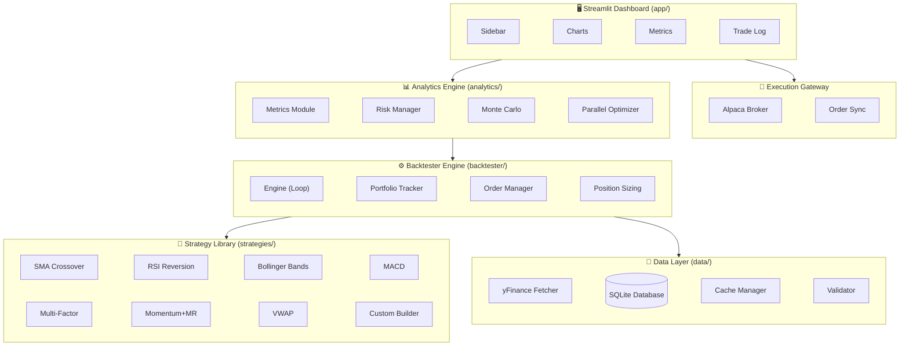

<div align="center">

# <i class="fa-solid fa-layer-group"></i> Alpha Engine

**Advance quantitative research, backtesting, and portfolio optimization platform built with Python.**

[](https://python.org)
[](LICENSE)
[](#testing)
[](#docker-deployment)

*Architected for high-performance backtesting, dynamic walk-forward optimization, and rigorous statistical validation of trading strategies.*

</div>

---

## 🎯 Highlights

**Key Achievements:**
- **High-Performance Backtesting Engine:** Engineered a vectorized, event-driven backtester processing millions of candles with sub-second latency using Parquet serialization and PyArrow.
- **Statistical Rigor & Risk Management:** Implemented 15+ institutional-grade metrics (Sharpe, Sortino, Tail Ratio, Omega) alongside dynamic ATR stop-losses, trailing stops, and portfolio circuit breakers.
- **Dynamic Walk-Forward Optimization:** Built a robust out-of-sample validation framework utilizing parallel grid search (`joblib`) to dynamically re-optimize parameters across rolling time windows, aggressively mitigating overfitting.
- **Multi-Asset Portfolio Analysis:** Developed a multi-threaded portfolio backtesting mode with correlation heatmap and diversification scoring for true portfolio-level testing.
- **Regime-Aware Signal Gating:** Designed an automated market regime detector (ADX/Volatility) that filters signals based on market conditions, ensuring strategies only deploy capital in compatible environments.
- **Live Execution Gateway:** Integrated Alpaca API for paper/live trading, translating strategy signals into real broker orders with a sync-to-target position management pattern.

---

## 🎯 Problem Statement

Retail traders and quant enthusiasts need a way to **backtest trading strategies** before risking real capital. This platform provides a modular, end-to-end pipeline:

1. **Fetch** → Real market data via Yahoo Finance with smart caching
2. **Signal** → Generate buy/sell signals using 9 configurable strategies
3. **Simulate** → Day-by-day backtesting with transaction costs and position sizing
4. **Analyze** → 15+ performance metrics including Sharpe, Sortino, Alpha, VaR
5. **Optimize** → Parallel grid search & walk-forward validation
6. **Visualize** → Interactive dashboard with equity curves, drawdown charts, Monte Carlo simulations
7. **Execute** → Paper/live trading via Alpaca broker integration

---

## 🏗️ Architecture


```mermaid
flowchart TD
    subgraph App ["🖥️ Streamlit Dashboard (app/)"]
        direction LR
        Sidebar ~~~ Charts ~~~ UI_Metrics["Metrics"] ~~~ TradeLog["Trade Log"]
    end

    subgraph Execution ["🔗 Execution Gateway"]
        direction LR
        Alpaca["Alpaca Broker"] ~~~ Gateway["Order Sync"]
    end

    subgraph Analytics ["📊 Analytics Engine (analytics/)"]
        direction LR
        MetricsMod["Metrics Module"] ~~~ RiskMgr["Risk Manager"] ~~~ MonteCarlo["Monte Carlo"] ~~~ Optimizer["Parallel Optimizer"]
    end

    subgraph Backtest ["⚙️ Backtester Engine (backtester/)"]
        direction LR
        Engine["Engine (Loop)"] ~~~ Portfolio["Portfolio Tracker"] ~~~ Orders["Order Manager"] ~~~ Sizing["Position Sizing"]
    end

    subgraph Strategies ["🧠 Strategy Library (strategies/)"]
        direction LR
        SMA["SMA Crossover"] ~~~ RSI["RSI Reversion"] ~~~ BB["Bollinger Bands"] ~~~ MACD["MACD"]
        MF["Multi-Factor"] ~~~ MoMR["Momentum+MR"] ~~~ VWAP["VWAP"] ~~~ Custom["Custom Builder"]
    end

    subgraph Data ["💾 Data Layer (data/)"]
        direction LR
        YF["yFinance Fetcher"] ~~~ DB[("SQLite Database")] ~~~ Cache["Cache Manager"] ~~~ Validator["Validator"]
    end

    App --> Execution
    App --> Analytics
    Analytics --> Backtest
    Backtest --> Strategies
    Backtest --> Data
```

---

## ✨ Key Features

| Feature | Description |
|---------|-------------|
| **9 Trading Strategies** | SMA Crossover, RSI Reversion, Bollinger Bands, MACD, Multi-Factor, Momentum+MR, VWAP Reversion, Buy & Hold, Custom Builder |
| **Custom Strategy Builder** | Define custom indicators and signal logic using pandas expressions directly in the UI |
| **Look-Ahead Bias Prevention** | `signal.shift(1)` ensures trades execute on T+1, not T |
| **Smart Data Caching** | SQLite database with intelligent gap detection — only fetches missing date ranges |
| **Transaction Costs** | Configurable commission (0.1%) and slippage (0.05%) applied to every trade |
| **Position Sizing** | Fixed capital %, fixed shares, and Kelly Criterion methods |
| **15+ Performance Metrics** | CAGR, Sharpe, Sortino, Calmar, Max DD, Win Rate, Profit Factor, VaR, CVaR, Alpha, Beta |
| **Walk-Forward Analysis** | Rolling window out-of-sample testing with dynamic optimization to detect overfitting |
| **Monte Carlo Simulation** | 1000 bootstrap paths for probabilistic risk assessment with stress testing |
| **Parallel Optimization** | Multi-core grid search using joblib to find optimal strategy parameters |
| **Multi-Asset Portfolio** | Backtest across multiple tickers with correlation heatmap and diversification scoring |
| **Regime Detection** | Automated market regime identification (ADX/Volatility) with signal gating |
| **Live Execution** | Alpaca paper/live trading integration with sync-to-target position management |
| **PDF Reports** | Professional 1-page PDF tear sheets with embedded equity curve and KPI table |
| **Docker Deployment** | One-command deployment with `docker-compose up` |
| **Interactive Dashboard** | Streamlit UI with Plotly charts, company name search, and benchmark comparison |
| **Comprehensive Tests** | 55 unit tests covering all modules with deterministic fixtures |

---

## 🚀 Quick Start

### Prerequisites
- Python 3.10+
- pip

### Installation

```bash
# 1. Clone the repository
git clone https://github.com/RintuRifle/alpha-engine.git
cd quant_research_platform

# 2. Create virtual environment
python -m venv venv
venv\Scripts\activate        # Windows
# source venv/bin/activate   # macOS/Linux

# 3. Install dependencies
pip install -r requirements.txt
pip install -e .

# 4. Configure environment
copy .env.example .env       # Windows
# cp .env.example .env       # macOS/Linux

# 5. Launch the dashboard
streamlit run app/streamlit_app.py
```

### Docker Deployment

```bash
# Build and run with Docker Compose
docker-compose up -d --build

# Access at http://localhost:8501

# Stop the container
docker-compose down
```

### Available Commands

```bash
make run        # Launch Streamlit dashboard
make test       # Run all unit tests
make coverage   # Run tests with coverage report
make lint       # Run flake8 linter
make format     # Auto-format code with black
make mypy       # Run static type checking
make ingest     # Fetch market data into SQLite
make clean      # Remove build artifacts
```

---

## 📊 Strategies Implemented

### 1. SMA Crossover
Buy when short-term SMA crosses above long-term SMA. Classic trend-following.
- **Parameters**: `short_window` (default: 50), `long_window` (default: 200)

### 2. RSI Mean Reversion
Buy when RSI drops below 30 (oversold), sell when RSI exceeds 70 (overbought).
- **Parameters**: `window` (14), `oversold` (30), `overbought` (70)

### 3. Bollinger Bands
Buy when price drops below the lower band, sell when price exceeds the upper band.
- **Parameters**: `window` (20), `num_std` (2.0)

### 4. MACD Signal Crossover
Buy when MACD line crosses above signal line, sell when it crosses below.
- **Parameters**: `fast_period` (12), `slow_period` (26), `signal_period` (9)

### 5. Multi-Factor
Composite scoring system combining SMA trend, RSI, Bollinger position, MACD, and volume analysis. Signals fire when the score exceeds a configurable threshold.
- **Parameters**: `min_score` (3), `rsi_window` (14), `bb_window` (20), `bb_std` (2.0)

### 6. Momentum + Mean Reversion
Hybrid strategy that combines trend-following (200 MA filter) with mean-reversion (RSI dips in uptrends).
- **Parameters**: `rsi_window` (14), `entry_rsi` (40), `exit_rsi` (55), `trend_ma` (200)

### 7. VWAP Reversion
Uses Volume-Weighted Average Price as a fair-value anchor. Buy when price deviates below VWAP, sell when it rises above.
- **Parameters**: `vwap_window` (20), `threshold` (0.02)

### 8. Buy & Hold (Benchmark)
Always buy, never sell. The baseline every strategy is compared against.

### 9. Custom Builder
Define your own strategy in the UI using pandas expressions and configurable indicators (SMA, EMA, RSI, MACD).

---

## 🧪 Testing

```bash
# Run all tests
pytest tests/ -v

# Run with coverage
pytest tests/ --cov=src --cov-report=term-missing -v
```

**55 tests** across 4 test files covering:
- Data validation (NaN handling, OHLCV sanity, volume checks)
- Strategy signals (all strategies, synthetic data verification)
- Backtester engine (equity curve, trades, transaction costs, position sizing)
- Analytics (CAGR, Sharpe, Max DD, Win Rate with known values)

---

## 📁 Project Structure

```
quant_research_platform/
├── config/
│   └── config.yaml              # DB path, capital, commission, strategy defaults
├── src/
│   ├── data/
│   │   ├── fetcher.py           # yfinance API + rate limiting + retry
│   │   ├── database.py          # SQLAlchemy ORM, parameterized queries
│   │   ├── validator.py         # NaN handling, OHLCV sanity checks
│   │   └── cache_manager.py     # Smart caching with gap detection
│   ├── strategies/
│   │   ├── base_strategy.py     # Abstract base class
│   │   ├── ma_crossover.py      # SMA/EMA crossover
│   │   ├── rsi_reversion.py     # RSI mean reversion
│   │   ├── bollinger_bands.py   # Bollinger band breakout
│   │   ├── macd_strategy.py     # MACD signal crossover
│   │   ├── multi_factor.py      # Composite scoring (7 factors)
│   │   ├── momentum_mr.py       # Trend + mean reversion hybrid
│   │   ├── vwap_strategy.py     # VWAP reversion strategy
│   │   ├── custom_builder.py    # User-defined pandas.eval() strategy
│   │   ├── buy_and_hold.py      # Benchmark strategy
│   │   └── regime_detector.py   # Market regime classifier (ADX/Vol)
│   ├── backtester/
│   │   ├── engine.py            # Day-by-day simulation (signal.shift(1)!)
│   │   ├── portfolio.py         # Cash, positions, equity curve
│   │   ├── order_manager.py     # BUY/SELL execution + cash check
│   │   ├── transaction_costs.py # Commission + slippage
│   │   └── position_sizing.py   # Fixed %, fixed shares, Kelly Criterion
│   ├── analytics/
│   │   ├── metrics.py           # Sharpe, Sortino, Calmar, CAGR, Win Rate
│   │   ├── risk_manager.py      # VaR, CVaR, Alpha, Beta
│   │   ├── benchmark.py         # SPY/NIFTY baseline comparison
│   │   ├── walk_forward.py      # Rolling window out-of-sample testing
│   │   ├── optimizer.py         # Serial grid search
│   │   ├── parallel_optimizer.py # Multi-core parallel grid search
│   │   ├── monte_carlo.py       # 1000-path equity simulation
│   │   ├── report_generator.py  # QuantStats HTML tear sheets
│   │   └── pdf_report.py        # PDF tear sheet generation
│   ├── execution/
│   │   ├── alpaca_broker.py     # Alpaca REST API wrapper
│   │   └── gateway.py           # Signal-to-order translation engine
│   └── utils/
│       ├── logger.py            # RotatingFileHandler + console
│       ├── helpers.py           # Config loader, formatters, utilities
│       ├── exceptions.py        # Custom exceptions with context
│       └── type_hints.py        # TypedDicts for type safety
├── app/
│   ├── streamlit_app.py         # Main dashboard entry point
│   └── components/
│       ├── sidebar.py           # Inputs, strategy params, company search
│       ├── charts.py            # Plotly: equity, drawdown, histogram, MC
│       ├── metrics_display.py   # 8 KPI cards with color coding
│       ├── optimizer_ui.py      # Parallel optimization UI + heatmap
│       ├── walk_forward_ui.py   # Walk-forward analysis UI
│       ├── multi_asset_ui.py    # Multi-asset backtest + correlation matrix
│       ├── strategy_builder_ui.py # Custom strategy definition UI
│       ├── strategy_comparison.py # Side-by-side strategy ranking
│       └── execution_ui.py      # Live execution gateway UI
├── tests/
│   ├── conftest.py              # Deterministic fixtures (seeded RNG)
│   ├── test_data_ingestion.py   # 8 tests: validator + mocked fetcher
│   ├── test_strategies.py       # 15 tests: all strategies + bias check
│   ├── test_backtester.py       # 12 tests: engine, costs, sizing
│   └── test_analytics.py        # 20 tests: metrics verification
├── Dockerfile                   # Container definition
├── docker-compose.yml           # One-command deployment
├── .dockerignore                # Docker build exclusions
├── .env.example                 # Template for secrets
├── .gitignore                   # Excludes venv, data, logs, .env
├── Makefile                     # make run | test | coverage | lint
├── setup.py                     # Package installer
├── requirements.txt             # Dependencies
└── README.md                    # You are here
```

---

## 🛡️ Security

- API keys and secrets are stored in `.env` (never committed)
- `.env.example` is committed with placeholder values
- Database queries use parameterized SQL (no SQL injection)
- All user inputs are sanitized before use

---

## 🔧 Configuration

All settings are centralized in `config/config.yaml`:

```yaml
trading:
  initial_capital: 10000.0
  commission: 0.001   # 0.1% per trade
  slippage: 0.0005    # 0.05% slippage

position_sizing:
  method: "fixed_capital"
  allocation: 0.10    # 10% per trade

data:
  default_tickers: ["AAPL", "MSFT", "RELIANCE.NS", "INFY.NS", "TCS.NS"]
  benchmark_ticker: "SPY"
```

---

## 📄 License

This project is licensed under the MIT License — see the [LICENSE](LICENSE) file.

---

<div align="center">

**Built by [Akshit Kumar Tiwari](https://github.com/RintuRifle)**

*If you found this useful, give it a ⭐ on GitHub!*

</div>
